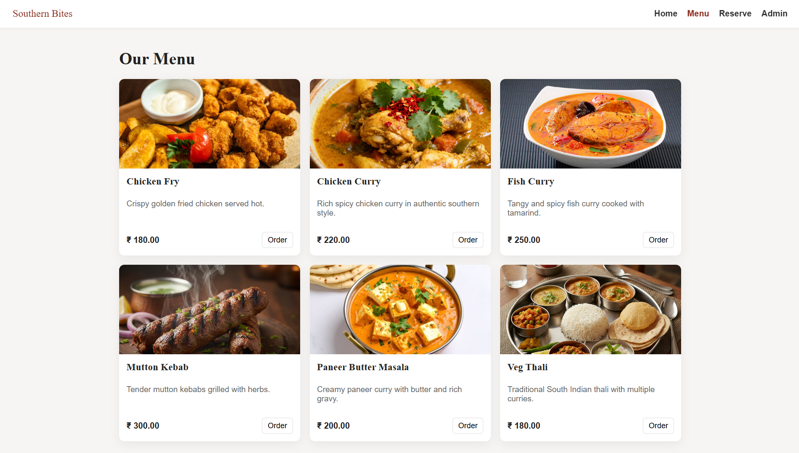
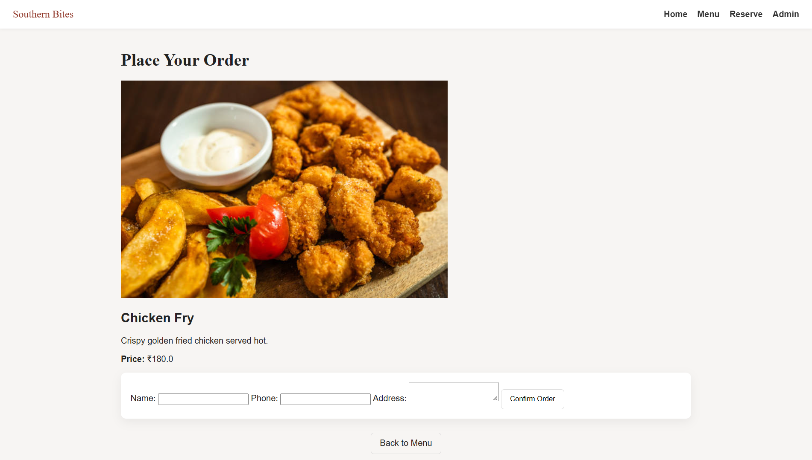
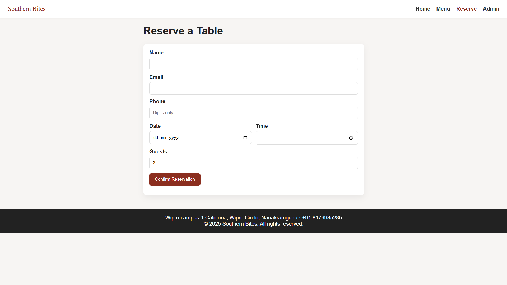

# SouthernBites

Live: https://southernbites.onrender.com

### Tech Stack

SouthernBites is a full-stack restaurant web app with a real backend, a real database, and a clean UI. It has a dynamic menu, an admin panel, and a simple order flow. Everything is deployed on Render using PostgreSQL and environment variables.

## Features

• Dynamic menu pulled from PostgreSQL  
• Admin login with protected actions  
• Add / update / delete menu items  
• Responsive UI (homepage, cards, menu grid, reservation page)  
• Order routing using item IDs  
• All assets and static files structured and optimized  
• Live deployment on Render with managed PostgreSQL  

## Screenshots

  
  
  
  

## Tech Used

Backend: Java 17, Spring Boot, Spring MVC, Spring Security, JPA, HikariCP  
Frontend: HTML, CSS, JavaScript, Thymeleaf  
Database: PostgreSQL  
Deployment: Render  

## Project Layout

controllers handle routes  
service contains business logic  
repository talks to the DB  
models store entities  
templates contain Thymeleaf pages  
static holds images, CSS, JS  
SouthernbitesApplication seeds initial menu items  

## What I learned building this

How to deploy a Spring Boot app correctly, connect it to a cloud PostgreSQL database, fix production-only issues, handle static assets in Spring Boot, and debug mismatches between filenames, seeds, and deployments.  
Also learned to manage Git branches, pull requests, and sync issues between local and remote.

## Running it locally

Clone the project, add a simple application.properties with local DB settings, and run via Maven.

## Environment Variables (Render)

SPRING_DATASOURCE_URL  
SPRING_DATASOURCE_USERNAME  
SPRING_DATASOURCE_PASSWORD  
